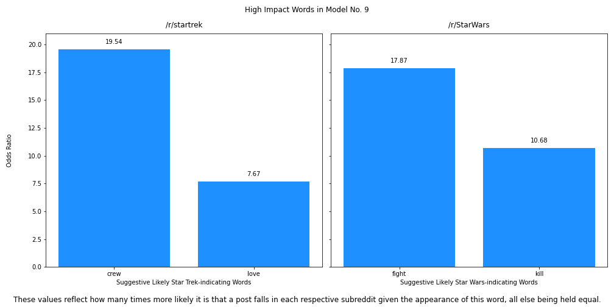

Science Officer's Log, Stardate 12345.67
-----
Thrust through a temporal anomaly while evading a [Gorn destroyer](https://memory-alpha.fandom.com/wiki/Gorn_destroyer), we found ourselves stranded on Earth in the year 2022, our ship disabled. 

Forced to use 21st century earth technology to repair our ship, we've decided that we must use contemporary humans to procure needed supplies. In desperation, we've decided our best hope for doing so without revealing ourselves (and thus setting off chaotic ripple effects throughout the space-time continuum) is to anonymously contact the best candidates we can find through a forum/social-media- type website known as 'Reddit'. 

We've narrowed our prospects down to two 'subreddits', channels on which users discuss specific topics. One is for the 'Star Trek' entertainment franchise on which so much of our own culture is based. The other is the subreddit that discusses another important science-fiction franchise, 'Star Wars'. Using 21st century computer technology and data science approaches we hope to learn as much as possible about these two sub-cultures and decide which group we should contact in order to gain access to the materials we need to repair our ship and, hopefully, return to our own century.

## Data Dictionary
The data used for analysis was pulled from [reddit.com](https://www.reddit.com) using [Pushshift's Reddit API](https://github.com/pushshift/api) on June 26, 2022.

|Feature|Type|Description|
|---|---|---|
|created_utc|int|Date/time created, Coordinated Universal Time (UTC), expressed as epoch.
|selftext|str|The body text of the post.
|subreddit|str|The subreddit the post came from.
|title|str|The title of the post.

Additional features were generated from this data.

|Feature|Type|Description|
|---|---|---|
|all_words|str|All of the words from the body and title concatenated.
|body_length|float|The length of the body, measured in characters.
|title_length|float|The length of the title, measured in characters.
|body_word_count|float|The number of words in the body.
|title_word_count|float|The number of words in the title.
|no_selftext|float|Whether or not the body is empty (1, yes (true); 0, no (false))
|avg_word_length|float|The average length of the words in the post, body and title both included.

## Brief Summary of Analysis
### Pulling Data
Data was pulled from /r/startrek and /r/StarWars using [Pushshift's Reddit API](https://github.com/pushshift/api) on June 26, 2022. The data was concatenated into a single dataset
### Data Cleaning and Feature Engineering
The only null values were found in the 'selftext' (post body) column. These were turned to empty spaces because they represented posts with no text in the body. Additional features were created at this stage ('all_words', 'body_length', 'title_length', 'body_word_count', 'title_word_count', 'no_selftext', and 'avg_word_length').
### EDA
The following features were examined across /r/startrek and /r/StarWars:
* rates of blank 'selftext' (post bodies)
* rates of removed posts
* word usage across removed posts and in comparison to non-removed posts, with 'neutral' stopwords removed and with 'english' stopwords removed.
* word usage across all posts, with 'english' stopwords removed and with 'expanded_stopwords' (with proper names and terms from each franchise as well as 'english' stopwords) removed.
* post body length, measured in number of characters, in non-removed and non-deleted posts, with and without outliers removed
* post body word count in non-removed and non-deleted posts, with and without outliers removed
* average word length in post bodies and titles ('all_words'), with and without outliers removed.

In addition, during EDA a list of the most common proper names and other show-specific words that appeared in these posts were created in order to use them as stopwords to make the modeling a more challenging task, for purposes of the project. This list also made it possible to see what non-franchise specific words appeared most frequently among the posts.
### Notable Findings From EDA
#### Star Wars Post Bodies Are Blank at a Higher Rate
Star Wars subredditors communicate text through title, alone, at a higher rate. This could reflect a higher rate of image posting or simply be a cultural feature of the subreddit.
#### NOTE: visualizations have black text labels on them that may not be visible if your computer is in "dark" mode. Please use "light" mode to make the labels visible.

NOTE: I referenced [this site](https://www.digitalocean.com/community/tutorials/markdown-markdown-images) and [this site](https://marinegeo.github.io/2018-08-10-adding-images-markdown/) to learn how to add images to markdown files.
#### Star Trek Posts Are Removed at a Higher Rate

Initially, it seemed possible this simply reflected unhappiness with new Star Trek TV shows, that perhaps angry viewers were violating moderation rules while torching shows they don't like.

While this may be a factor, examining [the rules for the startrek subreddit](https://www.reddit.com/r/startrek/wiki/guidelines) and [the rules for the StarWars subreddit](https://www.reddit.com/r/StarWars/wiki/rules) revealed interesting details. 

Subjectively, the Star Trek rules seem more attuned to interpersonal relationships (the first four are 'Be constructive', 'Be welcoming', 'Be honest', and 'Be nice'). None of the overall Star Wars rules speak about interpersonal behavior, though within the rules about 'comments' there is a rule about respecting fellow redditors, which links to [this page](https://www.reddit.com/r/StarWars/comments/cq4yv9/respecting_fellow_redditors_civility_bans_and_you/).

Interestingly, and perhaps tellingly, the Star Wars rules were also harder to find while the Star Trek ones were posted at the top of the page. 

This suggests that whether or not Star Trek fans are more likely to violate rules than Star Wars fans are, the moderation rules/moderators of the 'startrek' subreddit go further in enforcing some norms than those of the 'StarWars' subreddit.
#### Post Body Length (Number of Characters), Word Body Count Across Posts and Titles, and Average Word Length (Body and Title), With and Without Outliers Removed
Star Trek users write longer posts as measured by number of charactes and use slightly longer words. Because the words are slightly shorter, Star Wars posts are slightly longer than Star Trek posts when measured by word counts, with the exception of the mean when outliers *aren't* removed.

 

### Modeling
The baseline for this model is an accuracy of 50.9%, the percentage of posts that were from the /r/startrek subreddit.

9 models were built using different combinations of count vectorization and term frequency-inverse document frequency vectorization, multinomial naive-Bayes modeling, logistic regression modeling, random forest modeling, vote classification modeling (with decision trees, ada boosting, and gradient boosting), as well as adding additional features beyond the vectorized words (namely, post body length, title length, post body word count, title word count, average word length, and the presence or absence of post body text ('selftext'))

All models represented a significant improvement over the baseline accuracy

Ultimately, two models proved most effective as measured by both accuracy and Star Trek precision (more on that below).

#### Model 8, TfidifVectorizer, MultinomialNB, 'no_selftext' Feature Included
This model had an accuracy 0.873 and a Star Trek precision of 0.88 on test data. This is the preferred model for predicting whether or not a post is a Star Trek post.

#### Model 9: TfidfVectorizer, LogisticRegression, 'no_selftext' Feature Included
This model had an accuracy of 0.848 and a Star Trek precision of 0.83 on test data. This model is significant because it is the best logistic regression model, with parameters that can be examined to learn more about what words are most impactful on the model's predictions, all else held equal.

### Additional Conclusions Based on Model 9 Parameters
Examining the parameters from Model 9, which reflect log odds, revealed words that had a high impact on the model that also proved useful to answering our problem statement. Among the 10 words that most increased the odds that a post was a Star Trek post and a Star Wars post, respectively, were four significant, non-franchise specfic words, 'crew' and 'love' (Star Trek), and 'war' and 'kill' (Star Wars):

The possibility that recent storylines have led to the appearance of these words is noteworthy. As the posts examined were from a specific moment in time and new Star Trek and Star Wars material have been released recently, it may be these specific storylines influenced the appearance of words that might not appear at a different moment in time. However, in the absence of that information, it seems wise to take the appearance of these words as meaningful.

## Conclusions and Recommendations
I recommend that we contact Star Trek users for help in procuring the assistance we need to repair our ship and return to our own time. The single most important factor is the appearance of the words 'crew' and 'love' for Star Trek and 'war' and 'kill' among important words to our model. While we would ideally eliminate the possibility that these words are an artifact of recent storylines in each franchise, we are fighting time (no pun intended), and are better off acting on the assumption that these words reflect a difference in the nature of these two groups of subredditors.

Additionally, while there are many possible explanations for the differences in post length as measured by characters and average word lengths, it's possible that these are indications of greater verbal ability among Star Trek subredditors. This possibility is another point in favor of reaching out to Star Trek subredditors for help.

I recommend that we use Model 8 to analyze the communications we receive and identify Star Trek redditors. While we need to recognize that slightly more than 1 in 10 people we identify as being from the Star Trek fanbase are likely to be from the Star Wars fan base, it is worth noting that the model will be fooled by language that 'looks' Star Trek-like: this may reflect a more Star Trek-like nature to these Star Wars fans and, in fact, we may be able to get similar assistance from them.

NOTE ON PRECISION: It was on reaching the conclusion that we should contact Star Trek fans that I went back and checked the models for Star Trek precision, concluding that Model 8 was the best model by that measure as well as accuracy.

## FURTHER EXPLORATION
With more time, it would be interesting and perhaps helpful to explore:
* Who's posting on which site? Are they the same people or different people?
* How do posts by the same redditor change from one subreddit to the other, if at all?
* How do these subreddits compare to a sample of other subreddits, chosen at random?
* Are there other subreddits that "look" Star Trek-like to the model? Star Wars-like?
* How does this model perform on posts from a different time period?
* How do these models change if they're trained with posts selected from several time periods, rather than a block from a single time period? Would the same model still perform the best? Tuned the same or differently? Would a different base model (i.e. different vectorizer, naive-Bayes versus logistic regresion versus others) perform better?